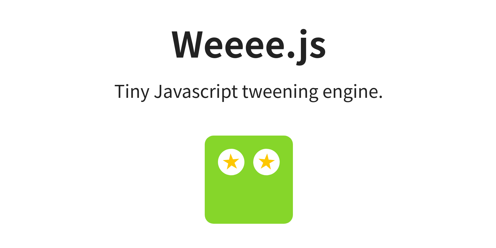

# Weeee.js
  

Tiny Javascript tweening engine.


[Homepage](https://sfi0zy.github.io/weeee)





## Usage

Step 1:

```sh
npm install --save weeee.js
```

Step 2:

```javascript
import Weeee from 'weeee.js';

const example = new Weeee({
    // <time in ms>
    // Infinity
    duration: 1000,

    //  <time in ms>
    delay: 0,

    //  Weeee.easeLinear
    //  Weeee.easeInCubic
    //  Weeee.easeOutCubic
    //  Weeee.easeInExpo
    //  Weeee.easeOutExpo
    //  Weeee.easeInElastic
    //  Weeee.easeOutElastic
    //  <any other f(x), which returns values from 0 to 1>
    easing: Weeee.easeLinear,

    //  Weeee.normal
    //  Weeee.reverse
    //  Weeee.alternate
    direction: Weeee.normal,

    //  true
    //  false
    autoplay: true,

    //  false
    //  <number of iterations>
    //  Infinity
    loop: false,

    // <time in ms>
    loopDelay: 0,

    //  <number from 1 to 60>
    fps: 60,

    //  <function(progress, details)>
    //
    // Weeee doesn't force us to manipulate with specific CSS, SVG,
    // Canvas or WebGL objects. Just do whatever you want here.
    //
    // Progress will be from 0 to 1.
    //
    // Additional details include:
    //  - startTime (when animation has been started, in ms)
    //  - currentTime (current time, may bee needed in infinite animations, in ms)
    //  - delta (time from the start, "currentTime - startTime", in ms)
    //  - isFinished (becomes true in the last frame of the finite animation)
    func: (progress, details) => {
        myElement.style.transform = `scale(${progress})`;
    },

    // Optional callback. It will be executed after the last frame of the animation.
    callback: () => {
        console.log('weeee!');
    }
});

// Also it's possible to start/stop/restart it manually. Callback will NOT be executed.
//
// example.start();
// example.stop();
// example.restart();
```


## CDN

It's possible to import Weeee right from the unpkg:

```javascript
import Weeee from 'https://unpkg.com/weeee.js/weeee.js';
```


## More examples

Examples on CodePen:

1. [Page loading](https://codepen.io/sfi0zy/pen/mdWQwzL)


## License

MIT License

Copyright (c) 2021 Ivan Bogachev sfi0zy@gmail.com

